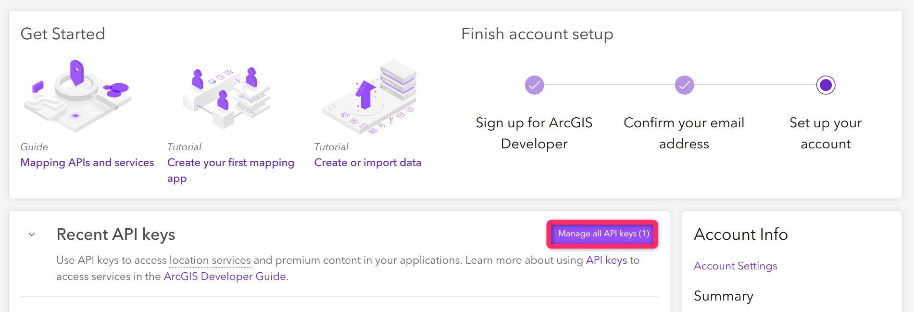
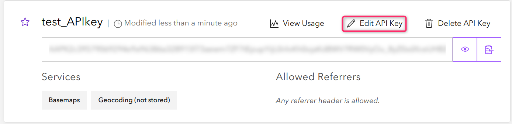
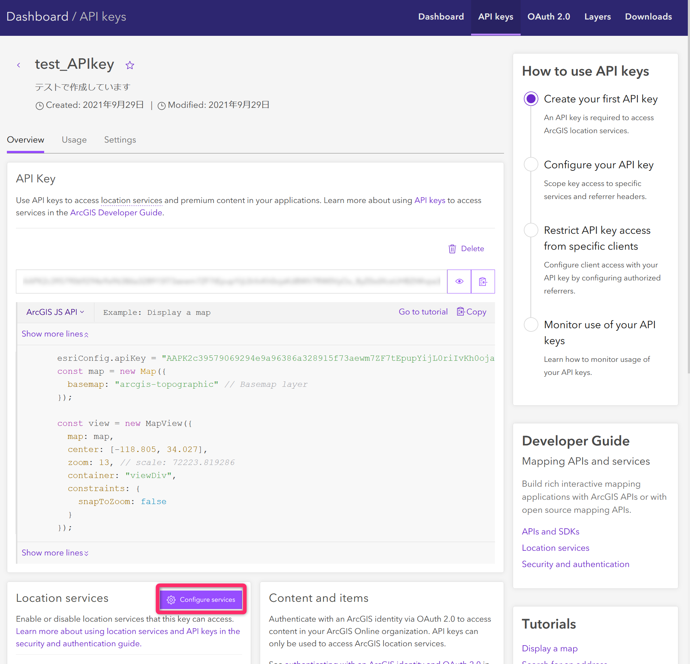
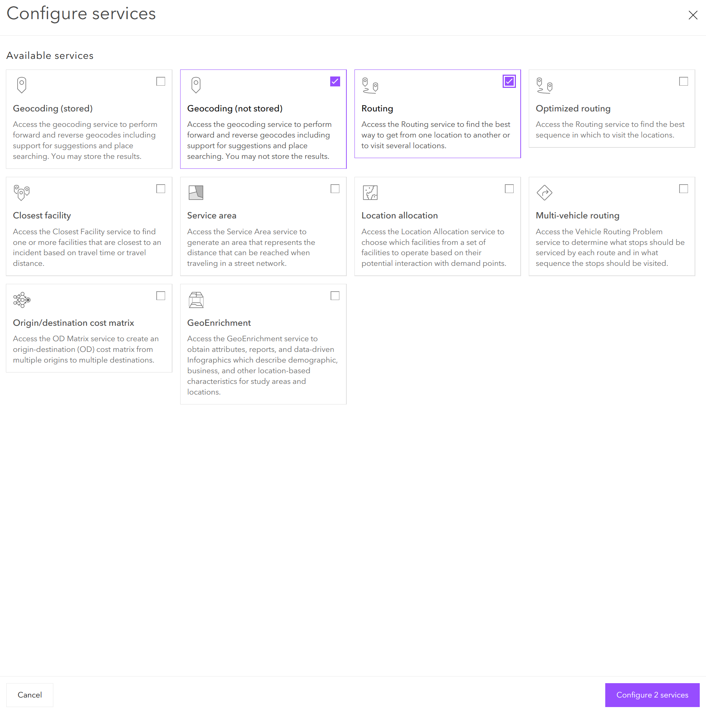
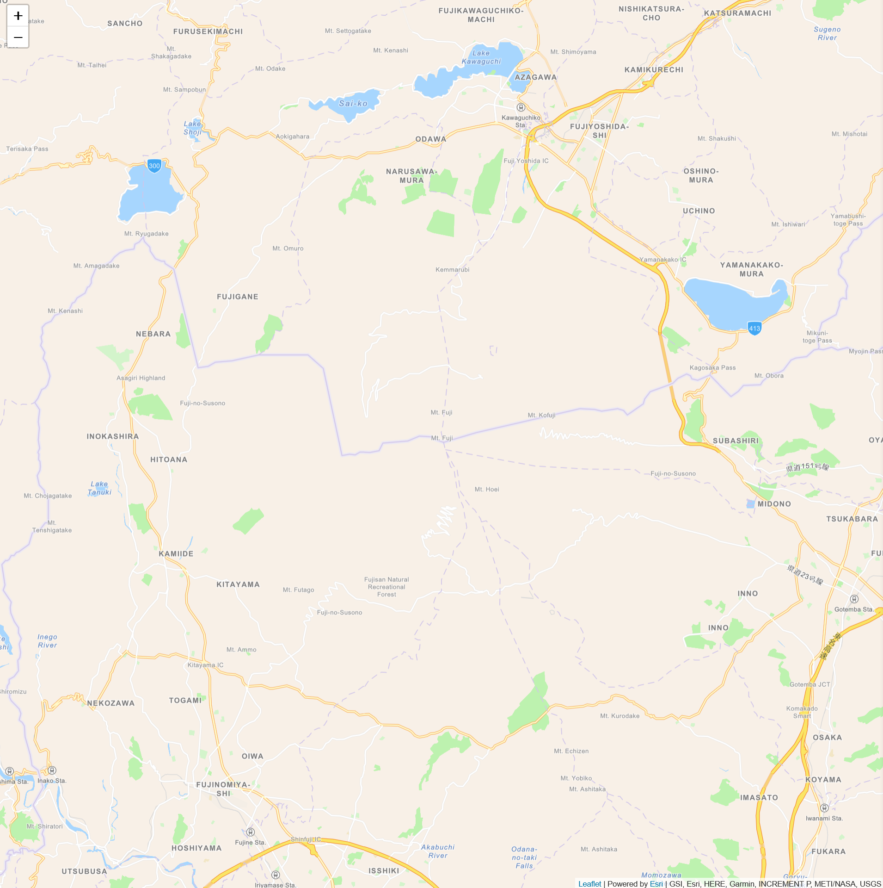
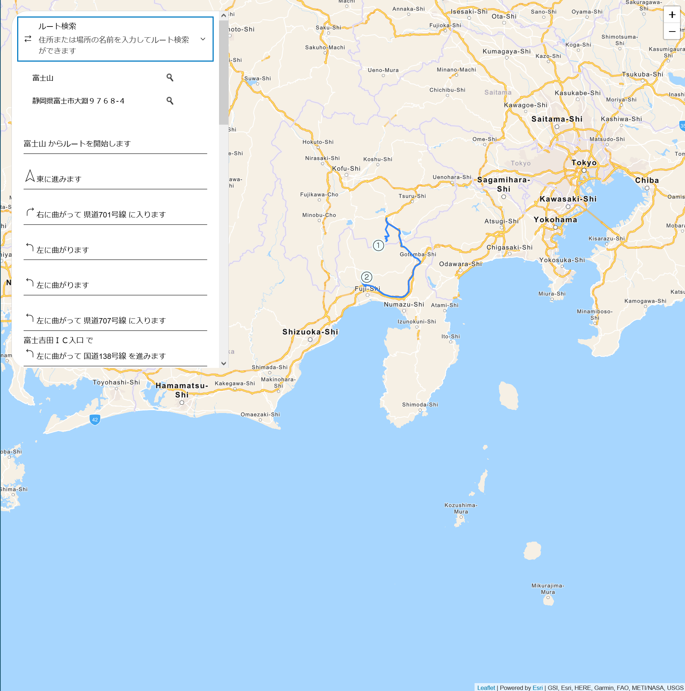

# ルート検索アプリの作成
[Leaflet](https://leafletjs.com/) は、メジャーで軽量なオープンソースのマッピング JavaScript ライブラリです。Leaflet は主に地図の表示や地図内に表示されるレイヤーの処理などを得意としています。
[Esri Leaflet](https://esri.github.io/esri-leaflet/) は、Esri のロケーションサービスが使えるオープンソースの Leaflet プラグインとなっています。

今回は、Leaflet と Esri Leaflet 及び、同じくオープンソースとして ESRI が提供している [ArcGIS REST JS](https://developers.arcgis.com/arcgis-rest-js/) を使ったルート検索アプリを作成します。

## API キーの作成と設定
始めに ルート検索と地名の検索の機能を使用するうえで必要となる開発者アカウントと API キーを作成します。

「[開発者アカウントの作成](https://esrijapan.github.io/arcgis-dev-resources/guide/get-dev-account/)」と「[API キーの取得](https://esrijapan.github.io/arcgis-dev-resources/guide/get-api-key/)」を参照に作成を行ってください。

「API キーの取得」が完了しましたら、以下の流れでロケーションサービスであるジオコーディングとルーティングを使用できるように設定します。

1. 開発者アカウントにログインし、ダッシュボードから API キーの設定編集ページに移動する

ダッシュボードから API キーの管理画面へ移動


API キーの管理画面。使用する API キーの Edit API Key をクリックし、API キーの設定編集ページへ。


2. API キーで使用するロケーションサービスを設定

ページ中部の Location services の欄から Configure services をクリック


この中から Geocoding (not stored) と Routing にチェック


ここまでで、使用するロケーションサービスが利用できるようになりましたので、ここからルート検索アプリを作成していきます。

## 地図の描画
まず、はじめに地図を描画しましょう。以下に HTML と JavaScript のコードを記します。

1. HTML 
Leaflet js と Esri Leaflet の参照を含む index.html を作成します。

```HTML
<html>

    <head>
        <meta charset="utf-8">
        <meta name="viewport" content="initial-scale=1,maximum-scale=1,user-scalable=no" />
        <title>Esri Leaflet</title>

        <!-- CDN から Leaflet の css と JS を取得 -->
        <link rel="stylesheet" href="https://unpkg.com/leaflet@1.7.1/dist/leaflet.css"
            integrity="sha512-xodZBNTC5n17Xt2atTPuE1HxjVMSvLVW9ocqUKLsCC5CXdbqCmblAshOMAS6/keqq/sMZMZ19scR4PsZChSR7A=="
            crossorigin=""/>
        <script src="https://unpkg.com/leaflet@1.7.1/dist/leaflet.js"
            integrity="sha512-XQoYMqMTK8LvdxXYG3nZ448hOEQiglfqkJs1NOQV44cWnUrBc8PkAOcXy20w0vlaXaVUearIOBhiXZ5V3ynxwA=="
            crossorigin=""></script>

        <!-- CDN から esri-Leaflet の js を取得 -->
        <script src="https://unpkg.com/esri-leaflet@3.0.0/dist/esri-leaflet.js"></script>

        <!-- ESRI のベクタータイルを使用するため CDN から esri-Leaflet-vector の js を取得 -->
        <script src="https://unpkg.com/esri-leaflet-vector@3.0.0/dist/esri-leaflet-vector.js"></script>
        <style>
            body { margin:0; padding:0; }
            #map {
                position: absolute;
                top:0;
                bottom:0;
                right:0;
                left:0;
                font-family: Arial, Helvetica, sans-serif;
                font-size: 14px;
                color: #323232;
            }
        </style>

    </head>

    <body>
        <div id="map"></div>
        <script type="text/javascript" src="main.js"></script>
    </body>

</html>
```

2. Javascript 
地図を描画するための main.js を作成します。

```JavaScript
// API キーを入力
const apiKey="YOUR_API_KEY";
const basemapEnum = "ArcGIS:Navigation";

// マップを描画する場所を富士山上空に指定
const map = L.map('map', {
    minZoom: 2
}).setView([35.362752, 138.729858], 12);

// Esri のベクタータイルをベースマップに設定
L.esri.Vector.vectorBasemapLayer(basemapEnum, {
  apiKey: apiKey
}).addTo(map);
```

実際に地図の描画をした様子は以下の通りとなっています


## 地名の検索の導入
今回、ルート検索を地名や住所から行えるようにするために esri-Leaflet-geocoder を参照しています。上記の地図を描画させた index.html と main.js に住所検索、地名検索を追加していきます。

1. index.html に esri-leaflet-geocorder への参照を追加

```HTML
<html>

    <head>
        <meta charset="utf-8">
        <meta name="viewport" content="initial-scale=1,maximum-scale=1,user-scalable=no" />
        <title>Esri Leaflet</title>

        <!-- CDN から Leaflet の css と JS を取得 -->
        <link rel="stylesheet" href="https://unpkg.com/leaflet@1.7.1/dist/leaflet.css"
            integrity="sha512-xodZBNTC5n17Xt2atTPuE1HxjVMSvLVW9ocqUKLsCC5CXdbqCmblAshOMAS6/keqq/sMZMZ19scR4PsZChSR7A=="
            crossorigin=""/>
        <script src="https://unpkg.com/leaflet@1.7.1/dist/leaflet.js"
            integrity="sha512-XQoYMqMTK8LvdxXYG3nZ448hOEQiglfqkJs1NOQV44cWnUrBc8PkAOcXy20w0vlaXaVUearIOBhiXZ5V3ynxwA=="
            crossorigin=""></script>

        <!-- CDN から esri-Leaflet の js を取得 -->
        <script src="https://unpkg.com/esri-leaflet@3.0.0/dist/esri-leaflet.js"></script>

        <!-- ESRI のベクタータイルを使用するため CDN から esri-Leaflet-vector の js を取得 -->
        <script src="https://unpkg.com/esri-leaflet-vector@3.0.0/dist/esri-leaflet-vector.js"></script>

        <!-- CDN から esri-Leaflet-geocoder の css と js を取得 -->
        <link rel="stylesheet" href="https://unpkg.com/esri-leaflet-geocoder@3.1.1/dist/esri-leaflet-geocoder.css" integrity="sha512-IM3Hs+feyi40yZhDH6kV8vQMg4Fh20s9OzInIIAc4nx7aMYMfo+IenRUekoYsHZqGkREUgx0VvlEsgm7nCDW9g==" crossorigin="">
        <script src="https://unpkg.com/esri-leaflet-geocoder@3.1.1/dist/esri-leaflet-geocoder.js"integrity="sha512-enHceDibjfw6LYtgWU03hke20nVTm+X5CRi9ity06lGQNtC9GkBNl/6LoER6XzSudGiXy++avi1EbIg9Ip4L1w==" crossorigin=""></script>
        
        <style>
            body { margin:0; padding:0; }
            #map {
                position: absolute;
                top:0;
                bottom:0;
                right:0;
                left:0;
                font-family: Arial, Helvetica, sans-serif;
                font-size: 14px;
                color: #323232;
            }
        </style>

    </head>

    <body>
        <div id="map"></div>
        <script type="text/javascript" src="main.js"></script>
    </body>

</html>
```

2. main.js に住所検索の機能を追加

```JavaScript
// API キーを入力
const apiKey="YOUR_API_KEY";
const basemapEnum = "ArcGIS:Navigation";

// マップを描画する場所を富士山上空に指定
const map = L.map('map', {
    minZoom: 2
}).setView([35.362752, 138.729858], 12);

// Esri のベクタータイルをベースマップに設定
L.esri.Vector.vectorBasemapLayer(basemapEnum, {
  apiKey: apiKey
}).addTo(map);

// 検索結果を入れるレイヤーの作成
let searchlayers=L.layerGroup().addTo(map);

// 住所、場所検索
const searchControl = L.esri.Geocoding.geosearch({
    position: 'topleft', // 検索窓をどこに配置するかを指定
    placeholder: '住所または場所の名前を入力',
    useMapBounds: false, // 世界中からの検索結果を出力
    providers: [L.esri.Geocoding.arcgisOnlineProvider({
      apikey: apiKey
    })]
}).addTo(map);
  
// 検索後の動作を指定。結果を地図上に描画。検索結果最上位を基本的に取得
searchControl.on('results', function (data) {
    if(data.results){
        coordinates = data.results[0].latlng;
        searchlayers.clearLayers(); //前回の結果を削除
        L.marker(coordinates).addTo(searchlayers);
    }    
});
```

地名検索で「富士山」と「富士市」を検索した結果が以下のようになります。


## ルート検索の導入
ルート検索を導入するために ArcGIS REST JS を参照します。ここでは、マップ上でクリックをするとマーカーが表示され、もう一度クリックした場所へのルート検索を実行するようなサンプルを作成しています。また、ルートまでの案内文も表示しています。

1. index.html に ArcGIS REST JS を参照を追加。ルート案内のメッセージを記すために div 要素も追加

```HTML
<html>

    <head>
        <meta charset="utf-8">
        <meta name="viewport" content="initial-scale=1,maximum-scale=1,user-scalable=no" />
        <title>Esri Leaflet</title>

        <!-- CDN から Leaflet の css と JS を取得 -->
        <link rel="stylesheet" href="https://unpkg.com/leaflet@1.7.1/dist/leaflet.css"
            integrity="sha512-xodZBNTC5n17Xt2atTPuE1HxjVMSvLVW9ocqUKLsCC5CXdbqCmblAshOMAS6/keqq/sMZMZ19scR4PsZChSR7A=="
            crossorigin=""/>
        <script src="https://unpkg.com/leaflet@1.7.1/dist/leaflet.js"
            integrity="sha512-XQoYMqMTK8LvdxXYG3nZ448hOEQiglfqkJs1NOQV44cWnUrBc8PkAOcXy20w0vlaXaVUearIOBhiXZ5V3ynxwA=="
            crossorigin=""></script>

        <!-- CDN から esri-Leaflet の js を取得 -->
        <script src="https://unpkg.com/esri-leaflet@3.0.0/dist/esri-leaflet.js"></script>

        <!-- ESRI のベクタータイルを使用するため CDN から esri-Leaflet-vector の js を取得 -->
        <script src="https://unpkg.com/esri-leaflet-vector@3.0.0/dist/esri-leaflet-vector.js"></script>
        
        <!-- CDN から esri-Leaflet-geocoder の css と js を取得 -->
        <link rel="stylesheet" href="https://unpkg.com/esri-leaflet-geocoder@3.1.1/dist/esri-leaflet-geocoder.css"
        integrity="sha512-IM3Hs+feyi40yZhDH6kV8vQMg4Fh20s9OzInIIAc4nx7aMYMfo+IenRUekoYsHZqGkREUgx0VvlEsgm7nCDW9g=="
        crossorigin="">
        <script src="https://unpkg.com/esri-leaflet-geocoder@3.1.1/dist/esri-leaflet-geocoder.js"
        integrity="sha512-enHceDibjfw6LYtgWU03hke20nVTm+X5CRi9ity06lGQNtC9GkBNl/6LoER6XzSudGiXy++avi1EbIg9Ip4L1w=="
        crossorigin=""></script>

        <!-- CDN から ArcGIS REST JS の js を取得 -->
        <script src="https://unpkg.com/@esri/arcgis-rest-request@3.0.0/dist/umd/request.umd.js"></script>
        <script src="https://unpkg.com/@esri/arcgis-rest-routing@3.0.0/dist/umd/routing.umd.js"></script>
        <script src="https://unpkg.com/@esri/arcgis-rest-auth@3.0.0/dist/umd/auth.umd.js"></script>

        <style>
            body { margin:0; padding:0; }
            #map {
                position: absolute;
                top:0;
                bottom:0;
                right:0;
                left:0;
                font-family: Arial, Helvetica, sans-serif;
                font-size: 14px;
                color: #323232;
            }
            #directions {
                position: absolute;
                z-index: 1000;
                width: 30%;
                max-height: 50%;
                right: 20px;
                top: 20px;
                overflow-y: auto; /* Show a scrollbar if needed */
                background: white;
                font-family: Arial, Helvetica, Verdana;
                line-height: 1.5;
                font-size: 14px;
                padding: 10px;
            }
        </style>

    </head>

    <body>
        <div id="map"></div>
        <div id="directions">ルート検索をしたい場所をクリックしてください</div>
        <script type="text/javascript" src="main.js"></script>
    </body>

</html>
```

2. main.js にクリックした地点でルート検索を行う機能を追加

```JavaScript
// API キーを入力
const apiKey="YOUR_API_KEY";
const basemapEnum = "ArcGIS:Navigation";

// マップを描画する場所を富士山上空に指定
const map = L.map('map', {
    minZoom: 2
}).setView([35.362752, 138.729858], 12);

// Esri のベクタータイルをベースマップに設定
L.esri.Vector.vectorBasemapLayer(basemapEnum, {
  apiKey: apiKey
}).addTo(map);

/* 住所検索の機能 */

// 検索結果を入れるレイヤーの作成
let searchlayers=L.layerGroup().addTo(map);

// 住所、場所検索
const searchControl = L.esri.Geocoding.geosearch({
    position: 'topleft', // 検索窓をどこに配置するかを指定
    placeholder: '住所または場所の名前を入力',
    useMapBounds: false, // 世界中からの検索結果を出力
    providers: [L.esri.Geocoding.arcgisOnlineProvider({
      apikey: apiKey
    })]
}).addTo(map);
  
// 検索後の動作を指定。結果を地図上に描画。検索結果最上位を基本的に取得
searchControl.on('results', function (data) {
    if(data.results){
        coordinates = data.results[0].latlng;
        searchlayers.clearLayers(); //前回の結果を削除
        L.marker(coordinates).addTo(searchlayers);
    }    
});

/* ルート検索の機能 */

// マップ上の検索結果をリセットするためにスタート地点とゴール地点、ルート案内のラインのレイヤーグループを作成
const startLayerGroup = L.layerGroup().addTo(map);
const endLayerGroup = L.layerGroup().addTo(map);
const routeLines = L.layerGroup().addTo(map);

let currentStep = "start"; 
let startCoords, endCoords;

// ルート検索をしたい地点を関数化
function addstoppoint(){
    if (currentStep === "start") {
      startLayerGroup.clearLayers(); 
      endLayerGroup.clearLayers(); 
      routeLines.clearLayers(); 
      L.marker(coordinates).addTo(startLayerGroup); // スタート地点にマーカーを作成
      startCoords = [coordinates.lng,coordinates.lat]; 
      currentStep = "end"; 
    } else {
      L.marker(coordinates).addTo(endLayerGroup); // ゴール地点にマーカーを作成
      endCoords = [coordinates.lng,coordinates.lat]; 
      currentStep = "start"; 
    }
  
    if (startCoords && endCoords) {
      searchRoute(); // スタート地点とゴール地点ができたらルート検索をかける
    }
}

// ルート検索の実行をする関数
function searchRoute() {
    // Create the arcgis-rest-js authentication object to use later.
    const authentication = new arcgisRest.ApiKey({
      key: apiKey
    });
    // make the API request
    arcgisRest
      .solveRoute({
        stops: [startCoords, endCoords], 
        endpoint: "https://route-api.arcgis.com/arcgis/rest/services/World/Route/NAServer/Route_World/solve",
        authentication,
        params:{directionsLanguage:"ja"} // 使用言語を日本語に変更
        })
        // 結果の表示
      .then((response) => {
        routeLines.clearLayers(); // 前回の結果をリセット
        L.geoJSON(response.routes.geoJson).addTo(routeLines); 
        const directionsHTML = response.directions[0].features.map((f) => f.attributes.text).join("<br/>");
        directions.innerHTML = directionsHTML;
        startCoords = null; // 最後にスタート、ゴール地点の位置情報をリセット
        endCoords = null;
      })
      // エラー時の表示
      .catch((error) => {
        console.error(error);
        alert("ルート検索に失敗しました");
      });
 }

 // クリックした場所の位置情報を返す
map.on("click", (e) => {
    coordinates = e.latlng;
    addstoppoint();
  });

```

ルート検索の結果としては以下のようになります。


## 地名検索をルート検索に反映
最後に地名検索をルート検索に反映させる。

1. 地名検索後、ルート検索の機能が動作するように設定

```HTML
<html>

    <head>
        <meta charset="utf-8">
        <meta name="viewport" content="initial-scale=1,maximum-scale=1,user-scalable=no" />
        <title>Esri Leaflet</title>

        <!-- CDN から Leaflet の css と JS を取得 -->
        <link rel="stylesheet" href="https://unpkg.com/leaflet@1.7.1/dist/leaflet.css"
            integrity="sha512-xodZBNTC5n17Xt2atTPuE1HxjVMSvLVW9ocqUKLsCC5CXdbqCmblAshOMAS6/keqq/sMZMZ19scR4PsZChSR7A=="
            crossorigin=""/>
        <script src="https://unpkg.com/leaflet@1.7.1/dist/leaflet.js"
            integrity="sha512-XQoYMqMTK8LvdxXYG3nZ448hOEQiglfqkJs1NOQV44cWnUrBc8PkAOcXy20w0vlaXaVUearIOBhiXZ5V3ynxwA=="
            crossorigin=""></script>

        <!-- CDN から esri-Leaflet の js を取得 -->
        <script src="https://unpkg.com/esri-leaflet@3.0.0/dist/esri-leaflet.js"></script>

        <!-- ESRI のベクタータイルを使用するため CDN から esri-Leaflet-vector の js を取得 -->
        <script src="https://unpkg.com/esri-leaflet-vector@3.0.0/dist/esri-leaflet-vector.js"></script>
        
        <!-- CDN から esri-Leaflet-geocoder の css と js を取得 -->
        <link rel="stylesheet" href="https://unpkg.com/esri-leaflet-geocoder@3.1.1/dist/esri-leaflet-geocoder.css"
        integrity="sha512-IM3Hs+feyi40yZhDH6kV8vQMg4Fh20s9OzInIIAc4nx7aMYMfo+IenRUekoYsHZqGkREUgx0VvlEsgm7nCDW9g=="
        crossorigin="">
        <script src="https://unpkg.com/esri-leaflet-geocoder@3.1.1/dist/esri-leaflet-geocoder.js"
        integrity="sha512-enHceDibjfw6LYtgWU03hke20nVTm+X5CRi9ity06lGQNtC9GkBNl/6LoER6XzSudGiXy++avi1EbIg9Ip4L1w=="
        crossorigin=""></script>

        <!-- CDN から ArcGIS REST JS の js を取得 -->
        <script src="https://unpkg.com/@esri/arcgis-rest-request@3.0.0/dist/umd/request.umd.js"></script>
        <script src="https://unpkg.com/@esri/arcgis-rest-routing@3.0.0/dist/umd/routing.umd.js"></script>
        <script src="https://unpkg.com/@esri/arcgis-rest-auth@3.0.0/dist/umd/auth.umd.js"></script>

        <style>
            body { margin:0; padding:0; }
            #map {
                position: absolute;
                top:0;
                bottom:0;
                right:0;
                left:0;
                font-family: Arial, Helvetica, sans-serif;
                font-size: 14px;
                color: #323232;
            }
            #directions {
                position: absolute;
                z-index: 1000;
                width: 30%;
                max-height: 50%;
                right: 20px;
                top: 20px;
                overflow-y: auto; /* Show a scrollbar if needed */
                background: white;
                font-family: Arial, Helvetica, Verdana;
                line-height: 1.5;
                font-size: 14px;
                padding: 10px;
            }
        </style>

    </head>

    <body>
        <div id="map"></div>
        <div id="directions">ルート検索をしたい場所をクリックまたは左の検索ボタンで追加してください</div>
        <script type="text/javascript" src="main.js"></script>
    </body>

</html>
```

```JavaScript
// API キーを入力
const apiKey="YOUR_API_KEY";
const basemapEnum = "ArcGIS:Navigation";

// マップを描画する場所を富士山上空に指定
const map = L.map('map', {
    minZoom: 2
}).setView([35.362752, 138.729858], 12);

// Esri のベクタータイルをベースマップに設定
L.esri.Vector.vectorBasemapLayer(basemapEnum, {
  apiKey: apiKey
}).addTo(map);

/* 住所検索の機能 */

/*
使用しなくなるため削除
// 検索結果を入れるレイヤーの作成
let searchlayers=L.layerGroup().addTo(map);
*/

// 住所、場所検索
const searchControl = L.esri.Geocoding.geosearch({
    position: 'topleft', // 検索窓をどこに配置するかを指定
    placeholder: '住所または場所の名前を入力',
    useMapBounds: false, // 世界中からの検索結果を出力
    providers: [L.esri.Geocoding.arcgisOnlineProvider({
      apikey: apiKey
    })]
}).addTo(map);
  
// 検索後の動作を指定。結果を地図上に描画。検索結果最上位を基本的に取得
searchControl.on('results', function (data) {
    if(data.results){
        coordinates = data.results[0].latlng;
        addstoppoint();
        /* 使用しなくなるため削除
        searchlayers.clearLayers(); //前回の結果を削除
        L.marker(coordinates).addTo(searchlayers);
        */
    }    
});

/* ルート検索の機能 */

// マップ上の検索結果をリセットするためにスタート地点とゴール地点、ルート案内のラインのレイヤーグループを作成
const startLayerGroup = L.layerGroup().addTo(map);
const endLayerGroup = L.layerGroup().addTo(map);
const routeLines = L.layerGroup().addTo(map);

let currentStep = "start"; 
let startCoords, endCoords;

// ルート検索をしたい地点を関数化
function addstoppoint(){
    if (currentStep === "start") {
      startLayerGroup.clearLayers(); 
      endLayerGroup.clearLayers(); 
      routeLines.clearLayers(); 
      L.marker(coordinates).addTo(startLayerGroup); // スタート地点にマーカーを作成
      startCoords = [coordinates.lng,coordinates.lat]; 
      currentStep = "end"; 
    } else {
      L.marker(coordinates).addTo(endLayerGroup); // ゴール地点にマーカーを作成
      endCoords = [coordinates.lng,coordinates.lat]; 
      currentStep = "start"; 
    }
  
    if (startCoords && endCoords) {
      searchRoute(); // スタート地点とゴール地点ができたらルート検索をかける
    }
}

// ルート検索の実行をする関数
function searchRoute() {
    // Create the arcgis-rest-js authentication object to use later.
    const authentication = new arcgisRest.ApiKey({
      key: apiKey
    });
    // make the API request
    arcgisRest
      .solveRoute({
        stops: [startCoords, endCoords], 
        endpoint: "https://route-api.arcgis.com/arcgis/rest/services/World/Route/NAServer/Route_World/solve",
        authentication,
        params:{directionsLanguage:"ja"} // 使用言語を日本語に変更
        })
        // 結果の表示
      .then((response) => {
        routeLines.clearLayers(); // 前回の結果をリセット
        L.geoJSON(response.routes.geoJson).addTo(routeLines); 
        const directionsHTML = response.directions[0].features.map((f) => f.attributes.text).join("<br/>");
        directions.innerHTML = directionsHTML;
        startCoords = null; // 最後にスタート、ゴール地点の位置情報をリセット
        endCoords = null;
      })
      // エラー時の表示
      .catch((error) => {
        console.error(error);
        alert("ルート検索に失敗しました");
      });
 }

 // クリックした場所の位置情報を返す
map.on("click", (e) => {
    coordinates = e.latlng;
    addstoppoint();
  });
```


## Calcite Design Systemによるデザイン
ここまで、ルート検索の基本的な機能を作ってきました。最後に発展形として Calcite Design System を使ったアプリのデザインの例をご紹介します。
Calcite Design System は、ESRI が提供しているアプリのデザイン作成をサポートするものです。これらを使って以下のようなアプリデザインを作成することができます。


