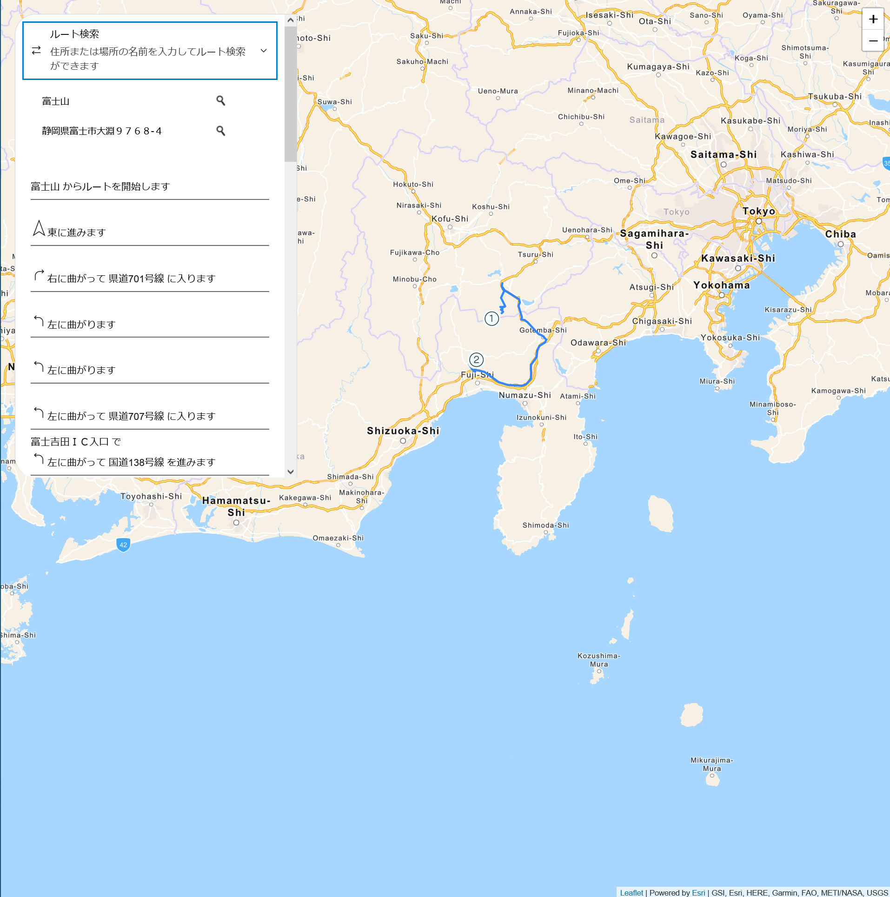

## Calcite Design Systemによるデザイン
ここでは、ルート検索アプリの発展形として [Calcite Design System](https://developers.arcgis.com/calcite-design-system/) を使ったアプリのデザインの例をご紹介します。
Calcite Design System は、ESRI が提供しているアプリのデザイン作成をサポートするものです。これらを使って以下のようなアプリデザインを作成することができます。

